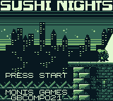
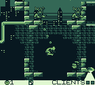
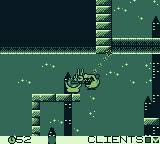
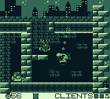

# Sushi Nights
    

Nights are tough in Neo Sushi City, and hunger spares no one. Only the most hardboiled of sheeps can safely deliver sushi fast enough to save the starving inhabitants of this ravaged metropolis.
Play as Hitsuji-kun, and use your trusty grappling hook to swing through buildings and alleys, locate the sushi, and deliver it to your targets.

Controls

    A: Jump
    B: Grappling hook / release
    Left-Right: Move / swing (while hanging from your grappling hook)
    Up-Down:  Reel-in and reel-out (while hanging from your grappling hook)

Credits

- [Zalo](https://twitter.com/Zal0)
- [Kirblue](https://twitter.com/Kirblue)
- [MaikelOrtega_](https://twitter.com/MaikelOrtega_)
- [sergiodeprado](https://twitter.com/sergiodeprado)

Made for the [#gbcompo21](https://itch.io/jam/gbcompo21)

Powered by [ZGB](https://github.com/Zal0/ZGB)